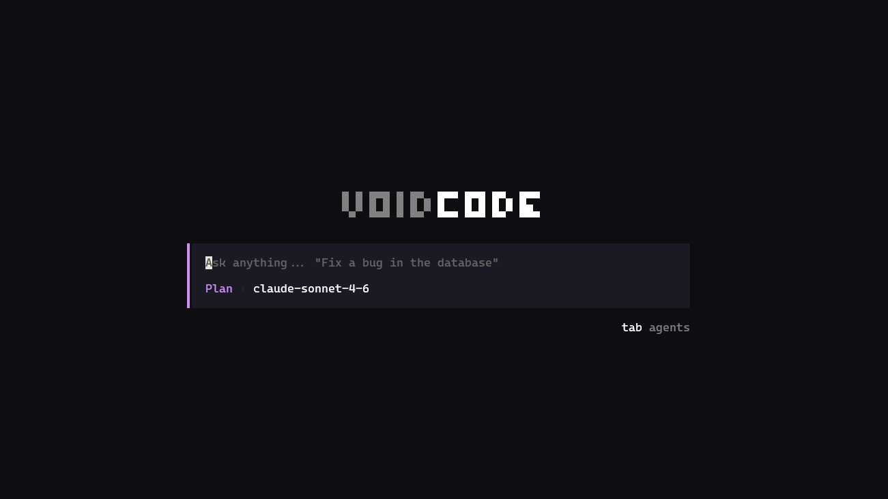

# VoidCode

VoidCode is a CLI-based AI coding assistant built as a Bun monorepo. It combines a polished TUI client, a streaming AI server, shared contracts, and a Prisma-backed data layer to deliver fast coding sessions directly in the terminal.

## Preview



## Why VoidCode stands out

- **Terminal-first experience** with a dedicated TUI built using React and OpenTUI
- **Two focused working modes**: `PLAN` for safe read-only analysis and `BUILD` for implementation
- **@mention file and folder targeting** to anchor prompts to precise workspace context
- **Streaming AI responses** with support for text, reasoning, and tool-driven workflows
- **Local project awareness** through filesystem and shell tools
- **Persistent sessions** stored in PostgreSQL via Prisma
- **OAuth 2.0 PKCE authentication built from scratch** for secure browser-based CLI login
- **Authentication and billing ready** with Clerk integration and Polar workflows
- **Multi-model support** across Anthropic, OpenAI, Azure OpenAI, and Google
- **Customizable developer UX** with model selection, theme switching, and session search

## Main features

### PLAN and BUILD modes

VoidCode is centered around two intentional modes of operation:

- **PLAN** — read-only analysis, research, and planning using safe inspection tools
- **BUILD** — full implementation mode with file editing and shell execution

This split makes it easy to use the assistant for either careful codebase exploration or direct code changes.

### Mention files and folders with `@`

VoidCode supports inline workspace mentions in the prompt input. Type `@` to search for files and folders from the current working directory, then select one to reference it directly in your prompt.

Examples:

```text
@packages/server/src/routes/chat.ts explain how streaming works in this route
@packages/cli/src/ summarize how the terminal UI is structured
@README.md suggest improvements for onboarding new contributors
```

What makes it useful:

- supports both **files and folders**
- works with **nested paths** like `@packages/cli/src/`
- falls back to **recursive search** for easier discovery
- keeps context selection **terminal-native and keyboard-friendly**

### Terminal UI built for coding workflows

The CLI provides a native-feeling terminal experience with:

- session creation and navigation
- searchable session history
- interactive model selection
- theme switching with persisted preferences
- streaming chat output inside a structured session shell
- keyboard-first interaction patterns
- slash commands for quick actions such as login, session switching, theme changes, model changes, and upgrade flows

### AI-powered, tool-enabled sessions

When working with a local project, VoidCode can inspect and act on code using tool contracts shared across the stack.

#### PLAN mode tools

- `readFile`
- `listDirectory`
- `glob`
- `grep`

#### BUILD mode tools

Includes all PLAN tools plus:

- `writeFile`
- `editFile`
- `bash`

### Secure authentication with OAuth 2.0 PKCE

VoidCode implements a full OAuth 2.0 PKCE login flow for the CLI experience, built to support secure browser-based authentication from a terminal app.

Flow overview:

1. The CLI generates a **code verifier** and **code challenge**
2. It opens the browser for sign-in
3. A temporary **local callback server** listens for the auth response
4. The callback validates **state** and **nonce**
5. The CLI exchanges the authorization code for an access token
6. The token is stored locally for subsequent authenticated requests

Security highlights:

- PKCE **verifier/challenge** generation
- **state and nonce** validation
- local callback handling for CLI login
- token storage with **restricted file permissions**
- automatic auth cleanup on logout or unauthorized responses

### Multi-provider model support

The server resolves supported chat models from multiple providers:

- Anthropic
- OpenAI
- Azure OpenAI
- Google

Model definitions, defaults, and pricing metadata live in `packages/shared/src/models.ts`.

### Session persistence and streaming

VoidCode stores session data in PostgreSQL and streams assistant output back to the CLI in real time. This enables:

- saved conversation history
- resumable long-running interactions
- metadata-aware messages with mode/model context
- usage tracking for billing and credits

### Billing and credit-aware usage

The server can calculate usage-based credits from model token consumption and connect those events to Polar-powered billing flows.

This makes the project especially compelling for production-oriented AI tooling because it already includes:

- authenticated usage tracking
- checkout and customer portal flows
- provider/model-aware credit calculation
- a path toward hosted or team-ready monetization

## Monorepo structure

This repository is organized as a Bun workspace monorepo:

- `packages/cli` — terminal UI client built with React and OpenTUI
- `packages/server` — Hono API server for auth, sessions, billing, and chat streaming
- `packages/database` — Prisma schema, generated client, and database exports
- `packages/shared` — shared schemas, model definitions, tool contracts, and common types

## Architecture overview

1. The CLI starts a session or opens an existing one.
2. Authentication is handled through a browser-based OAuth 2.0 PKCE flow.
3. The server persists sessions and messages in PostgreSQL using Prisma.
4. Chat requests are validated, assigned a model, and enriched with the correct toolset for the selected mode.
5. Users can target files or folders inline using `@` mentions while composing prompts.
6. Assistant responses stream back to the terminal UI in real time.
7. Usage can be converted into credits and ingested through Polar billing.

## Tech stack

VoidCode is built with a modern TypeScript-first stack:

- **Bun** — runtime, package manager, and workspace tooling
- **TypeScript** — shared typing across the monorepo
- **React** — powering the terminal UI
- **OpenTUI** — terminal rendering and interaction layer
- **Hono** — lightweight API server framework
- **Vercel AI SDK** (`ai`) — model streaming and tool-call orchestration
- **Prisma** — database access and schema management
- **PostgreSQL** — persistent session storage
- **Zod** — schema validation across client/server boundaries
- **Clerk-compatible OAuth flow** — powering secure sign-in for the CLI
- **Polar** — billing and credit workflows

## Getting started

### Prerequisites

- [Bun](https://bun.sh)
- PostgreSQL database access
- API credentials for one or more supported AI providers
- Clerk OAuth configuration for login
- Polar configuration if billing is enabled in your deployment

### Install dependencies

```bash
bun install
```

### Generate Prisma client

Prisma client generation is usually handled automatically during `bun install` via the workspace `postinstall` flow.

If you need to regenerate it manually (for example after changing the Prisma schema), run:

```bash
bun run --cwd packages/database db:generate
```

### Run the server

```bash
bun run dev:server
```

### Run the CLI

```bash
bun run dev:cli
```

## Scripts

### Root

```bash
bun run dev:server
bun run dev:cli
bun run build:cli
bun run link:cli
```

### Package scripts

- `packages/cli`: `bun run dev`, `bun run build`
- `packages/server`: `bun run dev`, `bun run build`
- `packages/database`: `bun run db:generate`

## Environment notes

Set up environment variables appropriate to your stack before running the project.

Common values include:

- `DATABASE_URL`
- `API_URL`
- `CLERK_FRONTEND_API`
- `CLERK_OAUTH_CLIENT_ID`
- provider API keys for Anthropic, OpenAI, Google, or Azure OpenAI
- Azure-specific settings such as API version when using Azure models
- Polar credentials for checkout and customer portal flows

A `.env.example` file is included in the codebase as a reference for the expected environment configuration.

## License

This project is licensed under the terms of the [LICENSE](./LICENSE) file.
